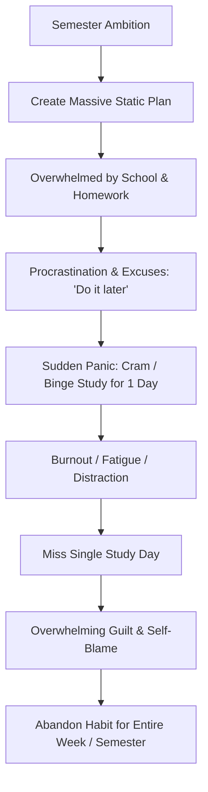
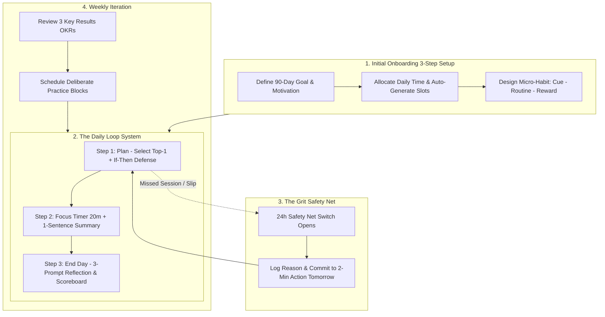
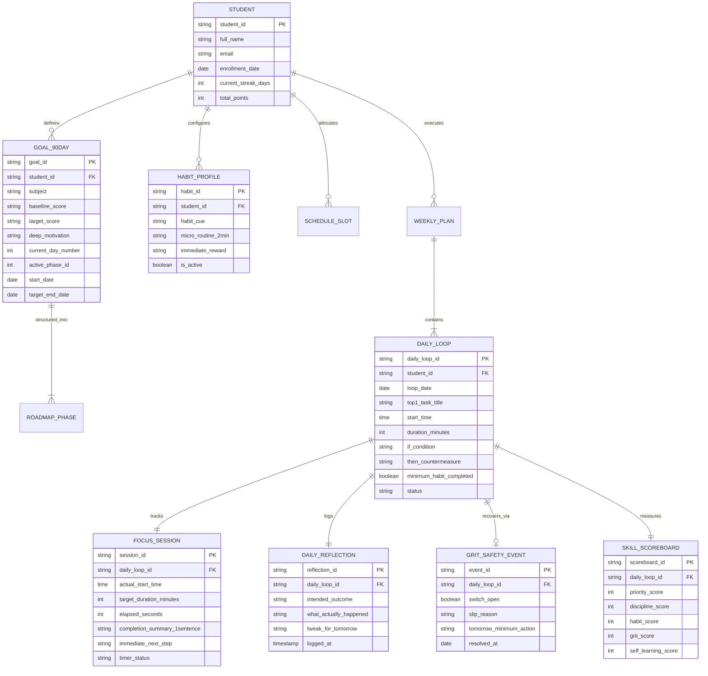

# Business Analysis & System Specifications (BA)
## Project Name: SMS - ALAN (Self-Management Skills Alan)
**Version:** 1.0  
**Date:** September 2026  
**Document Type:** Business Analysis & Functional System Specifications  
**Based on:** Research Presentation & Wireframe Specification (Vinschool GATE)  

---

## 1. Introduction & Context

### 1.1 Purpose
This document translates the conceptual behavioral research and wireframe specifications of **SMS - ALAN** into rigorous, actionable Business Analysis specifications. It bridges high-level business requirements and technical system architecture for engineering teams (No-Code Bubble, Full-Stack Web, or Mobile).

### 1.2 Business Analysis Scope
* **As-Is vs. To-Be Process Modeling:** Analysis of student behavioral failure patterns vs. the SMS - ALAN closed-loop operating system.
* **Information & Conceptual Data Architecture:** Detailed Entity-Relationship modeling, data dictionary, and state diagrams.
* **Detailed Functional Requirements:** Comprehensive feature-by-feature specifications covering all UI screens.
* **Non-Functional Requirements:** Usability, performance, security, and behavioral safety guardrails.

---

## 2. Business Process Modeling: As-Is vs. To-Be

### 2.1 As-Is Workflow: The "Binge-Guilt-Abandon" Cycle
Currently, students manage self-study via unstructured willpower and generic to-do lists:



### 2.2 To-Be Workflow: The SMS - ALAN Closed Behavioral Loop
SMS - ALAN replaces motivation with a guided, micro-action daily loop protected by a 24h reset safety net:



---

## 3. Information Architecture & Navigation Hierarchy

The application features a single-sidebar navigation model designed for zero clutter and minimal friction:

```
┌────────────────────────────────────────────────────────────────────────┐
│                               SMS - ALAN                               │
├───────────────┬────────────────────────────────────────────────────────┤
│ 1. Dashboard  │  • 90-Day Progression Banner (Day X/90, Phase Status)   │
│               │  • Today's Main Task (Top-1) & Scheduled Focus Window  │
│               │  • 5-Skill Scoreboard (0/1 Indicators)                 │
│               │  • Direct Action Buttons: [Plan] [Start Focus]         │
├───────────────┼────────────────────────────────────────────────────────┤
│ 2. Goals      │  • 90-Day Milestone Overview (Current vs. Target)       │
│ (Onboarding)  │  • Time Allocation & Weekly Block Schedule              │
│               │  • Configured Habit Loop (Trigger, Micro-Routine, Gift)│
├───────────────┼────────────────────────────────────────────────────────┤
│ 3. Daily Loop │  • Step 1: Daily Plan (Top-1, If-Then Shield, 2m Check)│
│               │  • Step 2: Focus Timer (Countdown, Micro-Summary)      │
│               │  • Step 3: End Day (Scoreboard, 3 Prompts, 24h Reset)  │
├───────────────┼────────────────────────────────────────────────────────┤
│ 4. Weekly     │  • 90-Day Objective Alignment                          │
│    Review     │  • 3 Expected Outcomes (Key Results)                   │
│               │  • Priority Focus Blocks (Scheduled Days & Times)      │
│               │  • Deliberate Practice Focus & Audio/Self-Feedback Log │
└───────────────┴────────────────────────────────────────────────────────┘
```

---

## 4. Conceptual Data Model & Entity Relationship (ER)



---

## 5. Functional Requirements Specifications

### Module 1: Onboarding Flow (The 3-Step Foundation Wizard)

#### FR-1.1: 90-Day Goal Definition (Step 1/3)
* **Description:** Collects student academic target, baseline, and psychological motivation.
* **Fields:**
  * `Subject`: Academic domain (e.g., English, Mathematics, Physics).
  * `Right Now (Baseline)`: Current quantitative or qualitative score (e.g., "9.0").
  * `Goal (Target)`: Target quantitative score (e.g., "9.5").
  * `90-Day Goal Statement`: High-level summary of capability improvement (e.g., "Students learn repeatedly every day, upgrade English score from 9 to 9.5, and talk confidently").
  * `Why did you choose this goal?`: Deep emotional/psychological driver (e.g., "Because I want to speak confidently and achieve academic excellence for upcoming exams").
* **Validation:** All fields mandatory. Target score must be distinct from baseline.

#### FR-1.2: Time Allocation & Automated Scheduler (Step 2/3)
* **Description:** Establishes realistic focus bandwidth and auto-generates recurring weekly study slots.
* **Fields & Rules:**
  * `Daily Free Time`: Number of minutes available daily (e.g., 30 mins/day).
  * `Priority Focus Time Slot`: Selected time of day (e.g., 19:45).
  * `Duration`: Target focus duration (constrained to 20–25 minutes to match optimal cognitive attention limits).
  * `Preview Schedule (Auto-Generated)`:
    * System algorithm generates weekly calendar slots based on user input:
      * Weekdays (Mon–Fri): Default at chosen evening slot (e.g., 19:45, 20 mins).
      * Weekend (Sat/Sun): Shifts to optimal morning timebox (e.g., Sat: 09:30, 25 mins).
* **Controls:** [Back], [Next].

#### FR-1.3: Micro-Habit Architecture (Step 3/3)
* **Description:** Anchors a 2-minute habit loop using James Clear / Charles Duhigg behavioral models.
* **Fields:**
  1. `Habit Cue`: Concrete contextual anchor (e.g., "After school, take a bath...").
  2. `2-Minute Routine`: Low-friction starter action (e.g., "Sit at desk and learn 5 new English words").
  3. `Immediate Reward`: Dopamine reinforcement (e.g., "Stick a sticker and listen to my favorite song").
* **Controls:** [Back], [Finish] $\rightarrow$ Redirects to Dashboard.

---

### Module 2: Dashboard & Progression Engine

#### FR-2.1: 90-Day Milestone Tracker
* **Description:** Displays active trajectory in the 90-day cycle.
* **Phases:**
  * **Phase 1 (Days 1–30):** *Priority & Discipline* (Focus on starting threshold, Top-1 task identification, 90-sec start ritual).
  * **Phase 2 (Days 31–60):** *Habit + Grit* (Strengthening cue-routine-reward loop, deploying 24h safety net).
  * **Phase 3 (Days 61–90):** *Mastery & Self-Learning* (Deliberate practice, reflective refinement, autonomy).
* **UI Indicator:** Displays current day and phase (e.g., `"Day 42/90 | Phase 2 (Days 31-60): Habit + Grit"`).

#### FR-2.2: Today's Focus Card
* Displays:
  * `Today's Main Task (Top-1)`: e.g., "Finish English homework and review 5 vocabulary words".
  * `Focus Time`: Scheduled timebox (e.g., "19:45 (20 mins)").
  * Primary Actions: `[Plan]` button (routes to Step 1 of Daily Loop), `[Start Focus]` button (routes directly to Timer).

#### FR-2.3: Live 5-Skill Scoreboard
* Real-time binary counters reflecting the 5 core behavioral competencies:
  * `Priority`: [0/1]
  * `Discipline`: [0/1]
  * `Habit`: [0/1]
  * `Grit (Reset)`: [0/1]
  * `Self-learning`: [0/1]

---

### Module 3: The Daily Loop Engine (3-Step Daily Routine)

```
[1. Plan Screen] ──────> [2. Focus Timer] ──────> [3. End Day Reflection]
```

#### FR-3.1: Daily Loop - Step 1: Plan
* **Components:**
  1. **Top-1 + Timebox Objectives:** Confirm task name, start time (e.g., 19:50), and duration (20 mins).
  2. **If-Then Distraction Defense (Gollwitzer Implementation Intentions):**
     * `IF`: Specific anticipated distraction (e.g., "want to use phone").
     * `THEN`: Immediate pre-committed physical response (e.g., "Put phone out of reach in another room").
  3. **2-Minute Habit Checklist (Starter Ritual):**
     * Visual flow representation: `[Take A Bath] ➔ [Learn 5 vocabulary words] ➔ [Listen to Music]`.
     * Checkbox: `[ ] Have completed minimum habit`. Checking marks Skill: Discipline as 1/1.
  4. Primary CTA: `[Start Focus]` transitions immediately to Step 2.

#### FR-3.2: Daily Loop - Step 2: Focus Timer
* **Components:**
  1. **Session Meta Banner:** Displays Task name ("Completed English homework"), Start time ("19:45"), and Target duration ("Goal: 20 min").
  2. **Active Countdown Timer:**
     * Visual digital display initialized to duration (e.g., `20:00`).
     * Controls: `[Start]` toggles countdown/pause; `[Reset]` returns timer to start value.
     * Sound/visual alert when countdown reaches `00:00`.
  3. **Post-Focus Micro-Log (Immediate Synthesis):**
     * `Done (Summary in 1 sentence)`: Short synthesis of output (e.g., "Have completed the lesson, learned 5 new words").
     * `Next step`: Forward commitment (e.g., "Next morning, practiced back these 5 words").
  4. Primary CTA: `[Finish Focus]` transitions immediately to Step 3.

#### FR-3.3: Daily Loop - Step 3: End Day
* **Components:**
  1. **Scoreboard Recap:** Real-time summary of completed skills for the day (e.g., `Priority: 1/1 | Discipline: 1/1 | Habit: 1/1 | Grit (Reset): 0/1 | Self-learning: 0/1`).
  2. **3 Self-Learning Reflection Prompts:**
     * `1) Intended outcome`: What did I set out to do? (e.g., "Master the grammar of present tense").
     * `2) What happened`: What were the actual results/challenges? (e.g., "Still a few mistakes when conjugating singular verbs").
     * `3) One tweak for tomorrow`: What actionable adjustment is needed? (e.g., "Read the subject carefully before filling in the answer").
  3. **24-Hour Safety Net (Grit Reset Switch):**
     * Toggle Switch: `[SWITCH: OPEN / CLOSED]`.
     * If user failed to focus or experienced friction, user toggles to `OPEN`:
       * `Reason`: Dropdown/text (e.g., "exhausted", "unplanned club event").
       * `Action to fix mistake tomorrow`: Micro-commitment (e.g., "Only do homework for minimum of 2 mins").
     * Activating the safety net awards the `Grit` point (1/1) and **preserves the streak**.
  4. **Streak Badge:** Displays cumulative consistent days (e.g., "Streak: 3 days").
  5. Primary CTA: `[Save & Finish]` closes the loop and updates the Dashboard.

---

### Module 4: Weekly Review & Deliberate Practice Planner

#### FR-4.1: Weekly OKR Alignment
* Displays the active 90-Day Objective (e.g., "Study regularly every day and improve your English score from 9.0 to 9.5").
* Allows student to set **3 Expected Outcomes (Key Results)** for the upcoming week:
  * Example KR 1: "Complete 3 English listening tests (Hoàn thành 3 bài kiểm tra nghe)".
  * Example KR 2: "Master 3 advanced vocabulary words daily (Làm chủ 3 từ vựng nâng cao mỗi ngày)".
  * Example KR 3: "Practice speaking for 15 minutes every morning (Luyện nói 15 phút mỗi sáng)".

#### FR-4.2: Priority Focus Blocks (Weekly Calendar View)
* Displays committed deep-work slots across the week:
  * Tuesday: 19:45 (20 mins)
  * Thursday: 19:45 (20 mins)
  * Saturday: 09:30 (25 mins)

#### FR-4.3: Deliberate Practice Focus Area
* Dedicates focus to targeted weakness isolation (Ericsson deliberate practice model):
  * Example: "Pronunciation: Record my voice and compare it with native speakers to fix ending sounds".
* Primary CTA: `[Finalize Weekly Plan]`.

---

## 6. Business Rules & Logic Matrices

### BR-01: Scoreboard Earning Rules
| Skill Column | Trigger / Completion Condition | Points Awarded |
| :--- | :--- | :--- |
| **Priority** | Defining Top-1 task and timebox during Daily Plan | 1 pt |
| **Discipline** | Checking `[x] Have completed minimum habit` (2-minute ritual) | 1 pt |
| **Habit** | Running Focus Timer to $\ge 80\%$ duration OR submitting 1-sentence wrap-up | 1 pt |
| **Grit (Reset)** | Successfully completing session OR activating 24h Safety Net Switch with reason + tomorrow action | 1 pt |
| **Self-Learning**| Submitting all 3 reflection prompts in End Day | 1 pt |

### BR-02: Streak Preservation via 24h Safety Net
* A streak is **NOT** broken if a day is missed, provided the student opens the `24h Safety Net Switch` within 24 hours of the missed slot and commits to a 2-minute minimum action for the subsequent day.
* If 48 consecutive hours elapse without either a completed session or a safety net submission, the streak resets to 0.

---

## 7. Non-Functional Requirements (NFR)

### 7.1 Usability & Aesthetic Design
* **NFR-U1 (Stress-Free UI):** The interface must utilize warm, friendly, calming tones (soft blues, mint greens, rounded borders, clear sans-serif typography) based on the Canva wireframes to reduce cognitive anxiety.
* **NFR-U2 (Fast Input):** Total daily planning must take $\le 120\text{ seconds}$. Total daily evening reflection must take $\le 180\text{ seconds}$.

### 7.2 Performance & Reliability
* **NFR-P1 (Timer Reliability):** The countdown timer must maintain absolute accuracy even if the browser tab is minimized or device screen sleeps (using timestamp delta comparison rather than naive `setInterval`).
* **NFR-P2 (Data Persistence):** Form state in the Daily Loop must auto-save to local storage so inadvertent browser refreshes do not erase reflection notes.

### 7.3 Scalability & Deployment
* **NFR-S1:** Solution must be deployable on No-Code platforms (Bubble.io) and/or modern front-end stacks (HTML5/CSS3/JavaScript, React, Vue).
