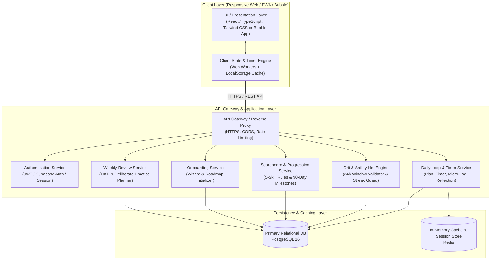
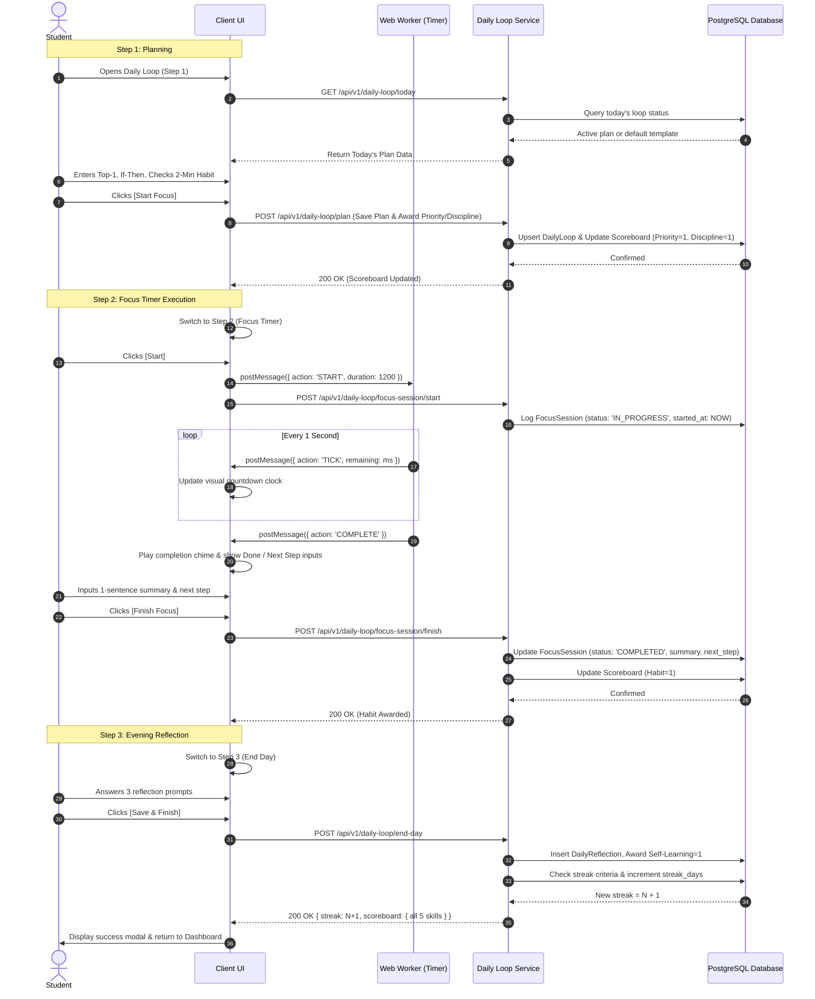
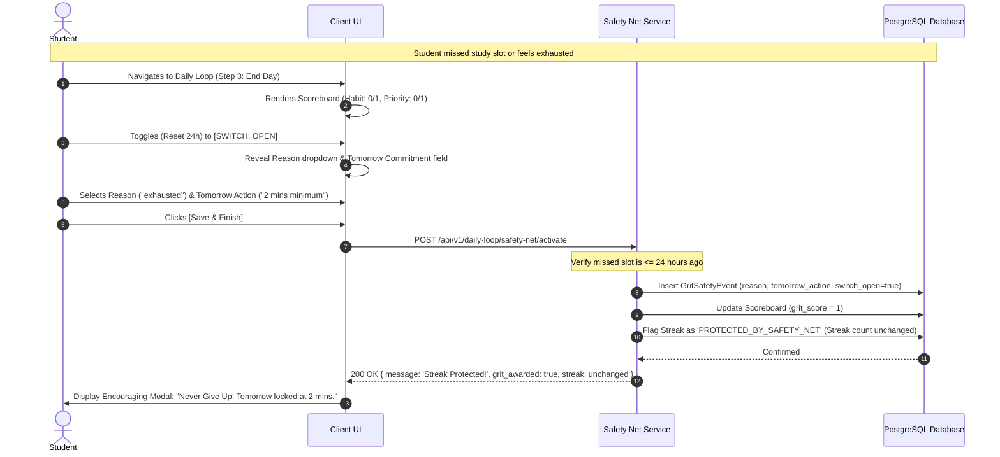
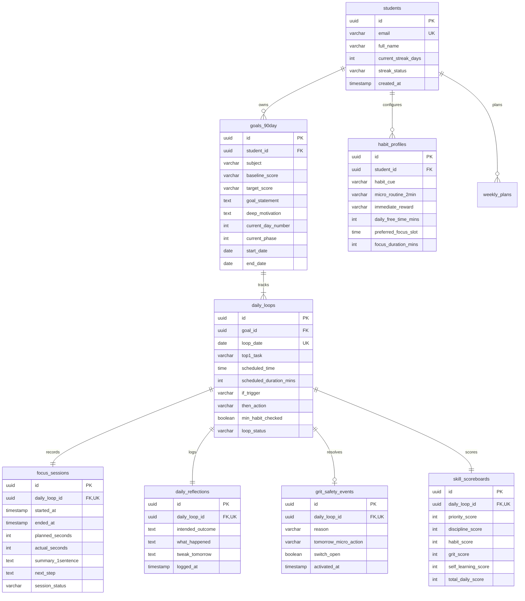

# Technical Design Document (TDD)
## Project Name: SMS - ALAN (Self-Management Skills Alan)
**Version:** 1.0  
**Date:** September 2026  
**Status:** Approved Baseline  
**Author:** Software Architecture & Engineering Team  
**Traceability:** Implements [BRD_SMS_Alan.md](file:///Users/user/Documents/SMS_Alan/Docs/BRD_SMS_Alan.md), [BA_Analysis_SMS_Alan.md](file:///Users/user/Documents/SMS_Alan/Docs/BA_Analysis_SMS_Alan.md), and [Use_Cases_SMS_Alan.md](file:///Users/user/Documents/SMS_Alan/Docs/Use_Cases_SMS_Alan.md)

---

## 1. System Overview & Architectural Objectives

### 1.1 Purpose
The purpose of this document is to specify the technical architecture, data models, API contracts, and Architecture Decision Records (ADRs) for **SMS - ALAN**, a "Behavioral Operating System" engineered to assist students in establishing sustainable self-study habits through a structured 90-day cycle.

### 1.2 Architectural Goals & Quality Attributes
* **Zero Cognitive Friction:** Interface must load instantly ($< 1\text{s}$ First Contentful Paint) and require minimal interactions (max 2–3 clicks per workflow stage).
* **Timer Precision & Background Resilience:** Study timers must remain $100\%$ accurate and immune to mobile/desktop browser background tab throttling, OS battery-saving sleeps, and screen locks.
* **Offline-First Resilience:** Network interruptions during focus sessions or reflection logging must never cause data loss. Local state persists and synchronizes optimistically.
* **Psychological Safety Guardrails:** Strict technical enforcement of the 24-Hour Safety Net state machine to prevent premature streak breakage and cognitive guilt spirals.

---

## 2. System Architecture

### 2.1 High-Level Architecture (C4 Container Diagram)



### 2.2 Client-Side Component Architecture

```
┌────────────────────────────────────────────────────────────────────────┐
│                         SMS - ALAN Client App                          │
├────────────────────────────────────────────────────────────────────────┤
│ 1. Navigation Shell: Sidebar (Dashboard, Goals, Daily Loop, Weekly)    │
├────────────────────────────────────────────────────────────────────────┤
│ 2. Feature Modules:                                                    │
│    ├── OnboardingWizard (Steps 1, 2, 3 with Local State Hydration)     │
│    ├── DashboardView (Milestone Banner, Today's Top-1, Live Scoreboard)│
│    ├── DailyLoopStepper:                                               │
│    │   ├── Step1_Plan (Top-1, Timebox, If-Then Shield, 2-Min Habit)    │
│    │   ├── Step2_FocusTimer (Web Worker Timer, Chime, 1-Sentence Done)  │
│    │   └── Step3_EndDay (Scoreboard Recap, 3 Prompts, 24h Reset Switch)│
│    └── WeeklyReviewView (90-Day Goal, 3 OKRs, Schedule, Deliberate Pr) │
├────────────────────────────────────────────────────────────────────────┤
│ 3. Core Technical Services:                                            │
│    ├── WorkerTimerManager: Drift-free background web worker timer       │
│    ├── LocalStorageRepository: Form draft auto-saver & offline cache   │
│    └── ScoreboardCalculator: Real-time 5-skill client-side evaluator   │
└────────────────────────────────────────────────────────────────────────┘
```

---

## 3. Sequence Diagrams & Behavioral Workflows

### 3.1 Daily Loop Flow: Plan $\rightarrow$ Focus $\rightarrow$ End Day



### 3.2 24-Hour Safety Net Resilience Flow (Anti-Guilt Protocol)



---

## 4. Data Models & Database Schema

### 4.1 Relational Schema Diagram (PostgreSQL 16)



### 4.2 Production DDL Specification (SQL)

```sql
-- Enable UUID generation extension
CREATE EXTENSION IF NOT EXISTS "uuid-ossp";

-- 1. Students Table
CREATE TABLE students (
    id UUID PRIMARY KEY DEFAULT uuid_generate_v4(),
    email VARCHAR(255) UNIQUE NOT NULL,
    full_name VARCHAR(100) NOT NULL,
    current_streak_days INT NOT NULL DEFAULT 0,
    streak_status VARCHAR(30) NOT NULL DEFAULT 'ACTIVE' 
        CHECK (streak_status IN ('ACTIVE', 'PROTECTED_BY_SAFETY_NET', 'BROKEN')),
    last_active_date DATE,
    created_at TIMESTAMP WITH TIME ZONE DEFAULT CURRENT_TIMESTAMP,
    updated_at TIMESTAMP WITH TIME ZONE DEFAULT CURRENT_TIMESTAMP
);

-- 2. 90-Day Goals Table
CREATE TABLE goals_90day (
    id UUID PRIMARY KEY DEFAULT uuid_generate_v4(),
    student_id UUID NOT NULL REFERENCES students(id) ON DELETE CASCADE,
    subject VARCHAR(100) NOT NULL,
    baseline_score VARCHAR(50) NOT NULL,
    target_score VARCHAR(50) NOT NULL,
    goal_statement TEXT NOT NULL,
    deep_motivation TEXT NOT NULL,
    current_day_number INT NOT NULL DEFAULT 1 CHECK (current_day_number BETWEEN 1 AND 90),
    current_phase INT NOT NULL DEFAULT 1 CHECK (current_phase BETWEEN 1 AND 3),
    start_date DATE NOT NULL DEFAULT CURRENT_DATE,
    end_date DATE NOT NULL,
    status VARCHAR(20) NOT NULL DEFAULT 'IN_PROGRESS' 
        CHECK (status IN ('IN_PROGRESS', 'GRADUATED', 'PAUSED')),
    created_at TIMESTAMP WITH TIME ZONE DEFAULT CURRENT_TIMESTAMP
);

-- 3. Habit Profile Table (Onboarding Step 3)
CREATE TABLE habit_profiles (
    id UUID PRIMARY KEY DEFAULT uuid_generate_v4(),
    student_id UUID NOT NULL REFERENCES students(id) ON DELETE CASCADE,
    habit_cue VARCHAR(255) NOT NULL,
    micro_routine_2min VARCHAR(255) NOT NULL,
    immediate_reward VARCHAR(255) NOT NULL,
    daily_free_time_mins INT NOT NULL DEFAULT 30,
    preferred_focus_slot TIME NOT NULL DEFAULT '19:45:00',
    focus_duration_mins INT NOT NULL DEFAULT 20 CHECK (focus_duration_mins BETWEEN 15 AND 35),
    is_active BOOLEAN NOT NULL DEFAULT TRUE,
    created_at TIMESTAMP WITH TIME ZONE DEFAULT CURRENT_TIMESTAMP
);

-- 4. Weekly Plans Table (Weekly Review)
CREATE TABLE weekly_plans (
    id UUID PRIMARY KEY DEFAULT uuid_generate_v4(),
    student_id UUID NOT NULL REFERENCES students(id) ON DELETE CASCADE,
    week_number INT NOT NULL CHECK (week_number BETWEEN 1 AND 13),
    objective_statement TEXT NOT NULL,
    key_result_1 VARCHAR(255) NOT NULL,
    key_result_2 VARCHAR(255) NOT NULL,
    key_result_3 VARCHAR(255) NOT NULL,
    deliberate_practice_focus TEXT NOT NULL,
    created_at TIMESTAMP WITH TIME ZONE DEFAULT CURRENT_TIMESTAMP
);

-- 5. Daily Loops Table (Master Daily Record)
CREATE TABLE daily_loops (
    id UUID PRIMARY KEY DEFAULT uuid_generate_v4(),
    goal_id UUID NOT NULL REFERENCES goals_90day(id) ON DELETE CASCADE,
    loop_date DATE NOT NULL,
    top1_task VARCHAR(255),
    scheduled_time TIME,
    scheduled_duration_mins INT DEFAULT 20,
    if_trigger VARCHAR(255),
    then_action VARCHAR(255),
    min_habit_checked BOOLEAN NOT NULL DEFAULT FALSE,
    loop_status VARCHAR(20) NOT NULL DEFAULT 'NOT_STARTED' 
        CHECK (loop_status IN ('NOT_STARTED', 'PLANNED', 'FOCUSED', 'COMPLETED', 'SAFETY_NET_RESET')),
    created_at TIMESTAMP WITH TIME ZONE DEFAULT CURRENT_TIMESTAMP,
    CONSTRAINT uq_goal_date UNIQUE (goal_id, loop_date)
);

-- 6. Focus Sessions Table
CREATE TABLE focus_sessions (
    id UUID PRIMARY KEY DEFAULT uuid_generate_v4(),
    daily_loop_id UUID UNIQUE NOT NULL REFERENCES daily_loops(id) ON DELETE CASCADE,
    started_at TIMESTAMP WITH TIME ZONE,
    ended_at TIMESTAMP WITH TIME ZONE,
    planned_seconds INT NOT NULL DEFAULT 1200,
    actual_seconds INT NOT NULL DEFAULT 0,
    summary_1sentence TEXT,
    next_step TEXT,
    session_status VARCHAR(20) NOT NULL DEFAULT 'NOT_STARTED' 
        CHECK (session_status IN ('NOT_STARTED', 'IN_PROGRESS', 'PAUSED', 'COMPLETED', 'ABORTED')),
    created_at TIMESTAMP WITH TIME ZONE DEFAULT CURRENT_TIMESTAMP
);

-- 7. Daily Reflections Table
CREATE TABLE daily_reflections (
    id UUID PRIMARY KEY DEFAULT uuid_generate_v4(),
    daily_loop_id UUID UNIQUE NOT NULL REFERENCES daily_loops(id) ON DELETE CASCADE,
    intended_outcome TEXT NOT NULL,
    what_happened TEXT NOT NULL,
    tweak_tomorrow TEXT NOT NULL,
    logged_at TIMESTAMP WITH TIME ZONE DEFAULT CURRENT_TIMESTAMP
);

-- 8. Grit Safety Net Events Table
CREATE TABLE grit_safety_events (
    id UUID PRIMARY KEY DEFAULT uuid_generate_v4(),
    daily_loop_id UUID UNIQUE NOT NULL REFERENCES daily_loops(id) ON DELETE CASCADE,
    reason VARCHAR(255) NOT NULL,
    tomorrow_micro_action VARCHAR(255) NOT NULL,
    switch_open BOOLEAN NOT NULL DEFAULT FALSE,
    activated_at TIMESTAMP WITH TIME ZONE DEFAULT CURRENT_TIMESTAMP
);

-- 9. Skill Scoreboards Table
CREATE TABLE skill_scoreboards (
    id UUID PRIMARY KEY DEFAULT uuid_generate_v4(),
    daily_loop_id UUID UNIQUE NOT NULL REFERENCES daily_loops(id) ON DELETE CASCADE,
    priority_score INT NOT NULL DEFAULT 0 CHECK (priority_score IN (0, 1)),
    discipline_score INT NOT NULL DEFAULT 0 CHECK (discipline_score IN (0, 1)),
    habit_score INT NOT NULL DEFAULT 0 CHECK (habit_score IN (0, 1)),
    grit_score INT NOT NULL DEFAULT 0 CHECK (grit_score IN (0, 1)),
    self_learning_score INT NOT NULL DEFAULT 0 CHECK (self_learning_score IN (0, 1)),
    total_daily_score INT GENERATED ALWAYS AS (
        priority_score + discipline_score + habit_score + grit_score + self_learning_score
    ) STORED,
    created_at TIMESTAMP WITH TIME ZONE DEFAULT CURRENT_TIMESTAMP
);

-- Indexes for Query Performance
CREATE INDEX idx_daily_loops_goal_date ON daily_loops(goal_id, loop_date);
CREATE INDEX idx_focus_sessions_loop ON focus_sessions(daily_loop_id);
CREATE INDEX idx_scoreboards_loop ON skill_scoreboards(daily_loop_id);
CREATE INDEX idx_students_streak ON students(current_streak_days, streak_status);
```

---

## 5. API Contracts (RESTful OpenAPI 3.1 Specification)

All API responses conform to the standard JSend / Envelope specification:
```json
{
  "status": "success | fail | error",
  "data": { ... },
  "message": "Optional human-readable explanation",
  "timestamp": "2026-09-05T10:00:00Z"
}
```

### 5.1 Endpoint Catalog

| Group | Method | Path | Summary | Wireframe / Use Case |
| :--- | :--- | :--- | :--- | :--- |
| **Onboarding** | `POST` | `/api/v1/onboarding/goal` | Register 90-day goal (Step 1) | Screen 1 / UC-01 |
| **Onboarding** | `POST` | `/api/v1/onboarding/time-allocation`| Set bandwidth & generate schedule (Step 2) | Screen 2 / UC-02 |
| **Onboarding** | `POST` | `/api/v1/onboarding/habit` | Configure Cue-Routine-Reward (Step 3) | Screen 3 / UC-03 |
| **Dashboard** | `GET` | `/api/v1/dashboard/summary` | Retrieve Day X/90, Phase, Task, Scoreboard | Screen 4 / UC-04 |
| **Daily Loop** | `GET` | `/api/v1/daily-loop/today` | Fetch active loop state & steps | Screens 5–7 / UC-05–07 |
| **Daily Loop** | `POST` | `/api/v1/daily-loop/plan` | Submit Step 1 (Top-1, If-Then, 2m Habit) | Screen 5 / UC-05 |
| **Focus Timer**| `POST` | `/api/v1/focus/start` | Initialize timer session | Screen 6 / UC-06 |
| **Focus Timer**| `POST` | `/api/v1/focus/finish` | Submit 1-sentence summary & next step | Screen 6 / UC-06 |
| **End Day** | `POST` | `/api/v1/daily-loop/end-day` | Submit 3-prompt reflection & close loop | Screen 7 / UC-07 |
| **Safety Net** | `POST` | `/api/v1/daily-loop/safety-net/activate` | Trigger 24h reset & preserve streak | Screen 7 / UC-08 |
| **Weekly** | `GET` | `/api/v1/weekly-review/current` | Fetch active weekly plan & OKRs | Screen 8 / UC-09 |
| **Weekly** | `POST` | `/api/v1/weekly-review/finalize` | Commit weekly OKRs & focus blocks | Screen 8 / UC-09 |

---

### 5.2 Detailed Endpoint Specifications

#### 1. POST `/api/v1/onboarding/goal`
* **Description:** Step 1/3 of onboarding. Saves 90-day academic goal, subject, benchmarks, and intrinsic motivation.
* **Request Body:**
```json
{
  "subject": "English",
  "baseline_score": "9.0",
  "target_score": "9.5",
  "goal_statement": "Students learn repeatedly every day and upgrade English score from 9 to 9.5 and talk more confidently.",
  "deep_motivation": "Because I want to talk more confidently and showed excellent academic results for future exams."
}
```
* **Response (201 Created):**
```json
{
  "status": "success",
  "data": {
    "goal_id": "8f3b20c9-94d3-4f9e-8c82-127e7d6b3891",
    "subject": "English",
    "current_day": 1,
    "current_phase": 1,
    "next_step": "TIME_ALLOCATION"
  }
}
```

#### 2. POST `/api/v1/onboarding/time-allocation`
* **Description:** Step 2/3 of onboarding. Sets daily bandwidth and auto-generates recurring weekly focus blocks.
* **Request Body:**
```json
{
  "daily_free_time_mins": 30,
  "preferred_focus_slot": "19:45:00",
  "focus_duration_mins": 20
}
```
* **Response (200 OK):**
```json
{
  "status": "success",
  "data": {
    "generated_schedule": [
      { "day_of_week": "Mon-Fri", "time": "19:45", "duration_mins": 20 },
      { "day_of_week": "Sat", "time": "09:30", "duration_mins": 25 }
    ],
    "next_step": "BUILD_HABIT"
  }
}
```

#### 3. GET `/api/v1/dashboard/summary`
* **Description:** Fetches all data necessary to render the unified dashboard (Screen 4).
* **Response (200 OK):**
```json
{
  "status": "success",
  "data": {
    "roadmap": {
      "current_day": 42,
      "total_days": 90,
      "phase_number": 2,
      "phase_name": "Habit + Grit",
      "phase_day_range": "Days 31-60"
    },
    "today_task": {
      "top1_title": "Finish English homework and review 5 vocabulary words.",
      "scheduled_time": "19:45",
      "duration_mins": 20,
      "loop_status": "PLANNED"
    },
    "scoreboard": {
      "priority": 0,
      "discipline": 0,
      "habit": 0,
      "grit": 0,
      "self_learning": 0,
      "total_possible": 5
    },
    "streak": {
      "days": 3,
      "status": "ACTIVE"
    }
  }
}
```

#### 4. POST `/api/v1/daily-loop/plan`
* **Description:** Step 1/3 of Daily Loop. Commits Top-1 task, If-Then contingency, and verifies 2-minute habit completion.
* **Request Body:**
```json
{
  "top1_task": "Learn 5 new English words",
  "scheduled_time": "19:50:00",
  "duration_mins": 20,
  "if_trigger": "want to use phone",
  "then_action": "Put phone out of reach",
  "min_habit_completed": true
}
```
* **Response (200 OK):**
```json
{
  "status": "success",
  "data": {
    "daily_loop_id": "c3e41b21-4f12-4aa8-bc19-1f486d3e8620",
    "loop_status": "PLANNED",
    "awarded_skills": {
      "priority": 1,
      "discipline": 1
    },
    "next_step": "FOCUS_TIMER"
  }
}
```

#### 5. POST `/api/v1/focus/finish`
* **Description:** Step 2/3 of Daily Loop. Concludes countdown timer and records 1-sentence synthesis and immediate next step.
* **Request Body:**
```json
{
  "actual_seconds": 1200,
  "summary_1sentence": "Have completed the lesson, learned 5 new words",
  "next_step": "Next morning, practiced back these 5 words"
}
```
* **Response (200 OK):**
```json
{
  "status": "success",
  "data": {
    "session_id": "f8a920c1-7b31-4ec1-91ea-2d4e78901234",
    "awarded_skills": {
      "habit": 1
    },
    "next_step": "END_DAY_REFLECTION"
  }
}
```

#### 6. POST `/api/v1/daily-loop/end-day`
* **Description:** Step 3/3 of Daily Loop. Submits 3 self-learning reflection prompts and finalizes the day.
* **Request Body:**
```json
{
  "intended_outcome": "Master the grammar of present tense.",
  "what_happened": "Still a few mistakes when conjuncting singular verbs",
  "tweak_tomorrow": "Read the subject carefully before filling in the answer"
}
```
* **Response (200 OK):**
```json
{
  "status": "success",
  "data": {
    "awarded_skills": {
      "self_learning": 1
    },
    "updated_streak": 4,
    "scoreboard_final": {
      "priority": 1,
      "discipline": 1,
      "habit": 1,
      "grit": 0,
      "self_learning": 1,
      "total_score": 4
    }
  }
}
```

#### 7. POST `/api/v1/daily-loop/safety-net/activate`
* **Description:** Activates the 24-Hour Safety Net switch when a student misses a session or experiences fatigue. Preserves streak and awards Grit point.
* **Request Body:**
```json
{
  "switch_open": true,
  "reason": "exhausted",
  "tomorrow_micro_action": "Only do homework for minimum for 2 mins"
}
```
* **Response (200 OK):**
```json
{
  "status": "success",
  "data": {
    "safety_net_active": true,
    "streak_preserved": true,
    "current_streak": 3,
    "awarded_skills": {
      "grit": 1
    },
    "coaching_message": "Never Give Up (NGU)! Your streak is protected. Tomorrow is locked to 2 minutes."
  }
}
```

---

## 6. Architecture Decision Records (ADRs)

---

### ADR-001: Technical Stack Selection (Responsive Web vs Native vs No-Code)

* **Status:** Accepted
* **Context:**
  The project originated with Canva wireframes and research presentations targeting high school students. The initial proposal suggested transitioning through No-Code tools (e.g., Bubble.io) and/or HTML5/CSS3. We need a stack that provides:
  1. Low latency and responsive layouts across iOS, Android, and Desktop.
  2. Native Web Worker timer precision without mobile browser throttling.
  3. Rapid iteration capability while allowing scalable database models.
* **Decision:**
  We adopt a **Decoupled Architecture**:
  * **Primary Web/PWA Client:** React (Next.js App Router) with Tailwind CSS, or a structured Bubble.io frontend consuming our backend via REST API Connector.
  * **Backend API & Persistence:** Node.js (TypeScript) / Express or Supabase BaaS (PostgreSQL 16 + Row Level Security).
* **Consequences:**
  * *Positive:* Supports progressive web app (PWA) installation to mobile home screens with zero App Store friction; full schema integrity in PostgreSQL; identical API can support both Bubble and custom code.
  * *Negative:* Requires managing API schemas and CORS headers between frontend and backend.

---

### ADR-002: Drift-Free Background Timer Implementation

* **Status:** Accepted
* **Context:**
  Mobile Safari and Chromium heavily throttle JavaScript `setInterval` and `setTimeout` loops when a browser tab is placed in the background or the screen sleeps. A standard 20-minute timer can drift by up to 5–10 minutes, breaking user trust during deep work sessions.
* **Decision:**
  Implement a **Timestamp-Delta Web Worker Timer** combined with server-side session sync:
  1. When timer starts, store `target_end_timestamp = performance.now() + duration_ms` and `wall_clock_end = Date.now() + duration_ms`.
  2. Run the countdown interval inside a dedicated **Web Worker**, which is immune to main-thread DOM throttling.
  3. On `visibilitychange` (when student returns to tab), immediately calculate `remaining_ms = wall_clock_end - Date.now()` to reconcile any drift instantly.
* **Consequences:**
  * *Positive:* $100\%$ timing accuracy; zero clock drift across screen locks; robust user trust.
  * *Negative:* Web Workers require postMessage serializations and HTTPS serving.

---

### ADR-003: 24-Hour Safety Net State Machine & Anti-Guilt Streak Algorithm

* **Status:** Accepted
* **Context:**
  The core behavioral insight from the Vinschool research is that missing just ONE study day triggers guilt, causing students to abandon their commitments for the entire week. Standard streak counters penalize students by abruptly resetting to 0, which induces psychological despair.
* **Decision:**
  Implement a **Soft-Leniency 2-State Streak Algorithm**:
  * A streak day is counted if $\text{DailyLoop} = \text{COMPLETED}$.
  * If a day passes without completion, the user enters state `SAFETY_NET_PENDING`.
  * The student has a **24-hour grace window** from their scheduled focus timebox.
  * If student toggles the `(Reset 24h)` switch, supplies a valid `reason`, and commits to a `2-minute action tomorrow`, the streak status becomes `PROTECTED_BY_SAFETY_NET`. The streak count is preserved, and the `Grit (Reset)` skill point (1/1) is awarded.
  * If 48 hours elapse without either completion or safety net activation, the streak resets to 0 with a gentle restart prompt.
* **Consequences:**
  * *Positive:* Scientifically eliminates the "what-the-hell" guilt spiral; rewards psychological resilience (Grit) rather than punishing exhaustion.
  * *Negative:* Requires scheduled backend cron job (running every hour) to evaluate elapsed grace windows.

---

### ADR-004: Offline-First Local Storage Hydration

* **Status:** Accepted
* **Context:**
  Students frequently write meaningful personal reflections at the end of the day or fill out If-Then distraction shields. An accidental browser reload or flaky school Wi-Fi connection could wipe their inputs, generating immense frustration.
* **Decision:**
  Implement optimistic local persistence:
  1. Every form input in the Daily Loop (Top-1, If-Then, Timer summary, 3 Prompts) automatically debounces and writes to `localStorage` under key `sms_draft_${student_id}_${date}`.
  2. Upon page mount, the client checks if remote state exists; if remote state is empty but local draft exists, hydrate from local storage.
  3. Clear draft only upon receipt of HTTP 200 from the backend API.
* **Consequences:**
  * *Positive:* Zero data loss during study sessions; smooth, stress-free user experience.
  * *Negative:* Requires schema versioning for local storage keys to prevent collisions across updates.

---

### ADR-005: Stress-Free Aesthetic & Design Token System

* **Status:** Accepted
* **Context:**
  Traditional productivity apps rely on stark reds, urgent warning badges, and high-contrast alert states that heighten student anxiety. The Canva wireframes specify a friendly, calming "Behavioral OS" with soft colors and clear rounded buttons.
* **Decision:**
  Standardize on a calming pastel palette:
  * **Brand Primary:** Soft Sky Blue (`#70C8E2` / `hsl(193, 68%, 66%)`)
  * **Accent / Energy:** Pastel Coral Pink (`#FF8A8A` / `hsl(0, 100%, 77%)`)
  * **Success / Habit:** Mint Green (`#84E3A5` / `hsl(141, 64%, 70%)`)
  * **Background Surface:** Clean Calm Chalk (`#F8F9FA`)
  * **Typography:** Clean, highly legible sans-serif (`Inter`, `SF Pro Display`, or `Quicksand` for playful accents).
* **Consequences:**
  * *Positive:* Significantly lowers cortisol and cognitive resistance during study planning.
  * *Negative:* Must verify WCAG AA color contrast standards against white backgrounds.

---

## 7. Security, Privacy & Reliability Guardrails

1. **Student Privacy Protection (FERPA / Minors Alignment):**
   * Student emails and reflection logs are encrypted at rest using AES-256.
   * Daily reflection texts are strictly private to the student; no public sharing or peer inspection in MVP.
2. **Rate Limiting:**
   * Public API endpoints rate-limited to 60 requests per minute per IP via Redis token bucket.
3. **Session Resumption:**
   * If a device restarts mid-session, the client retrieves the active session timestamp from `/api/v1/daily-loop/today` and restores the remaining countdown time accurately.
